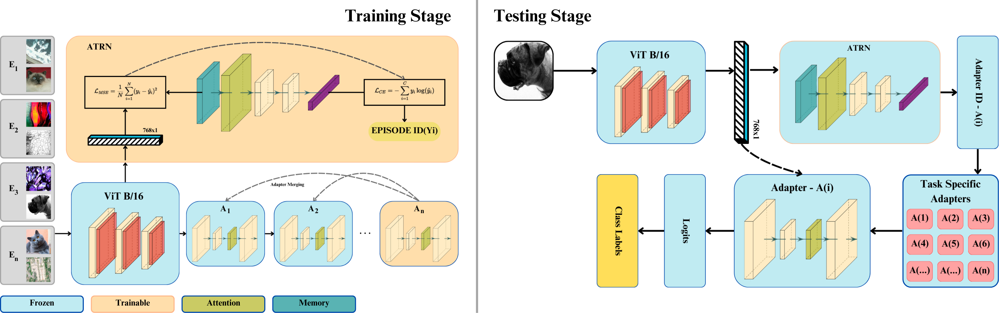
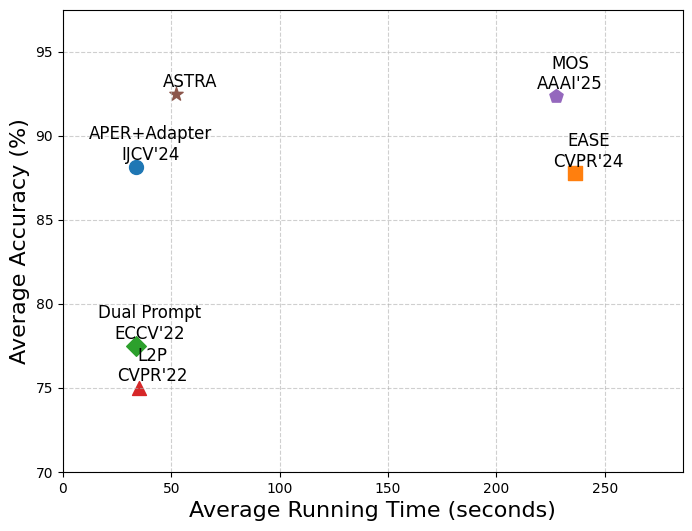
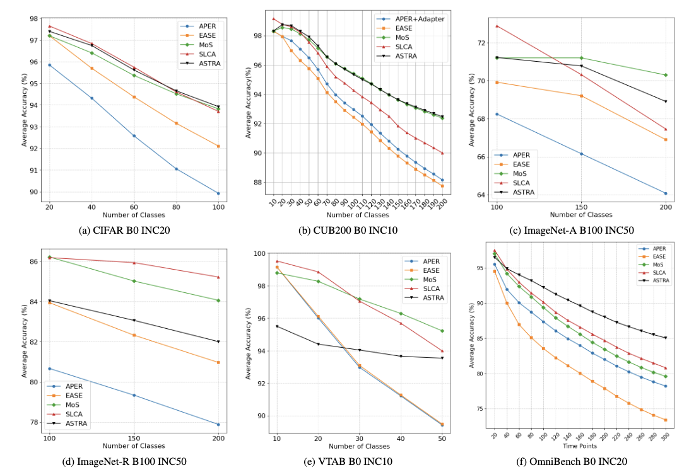
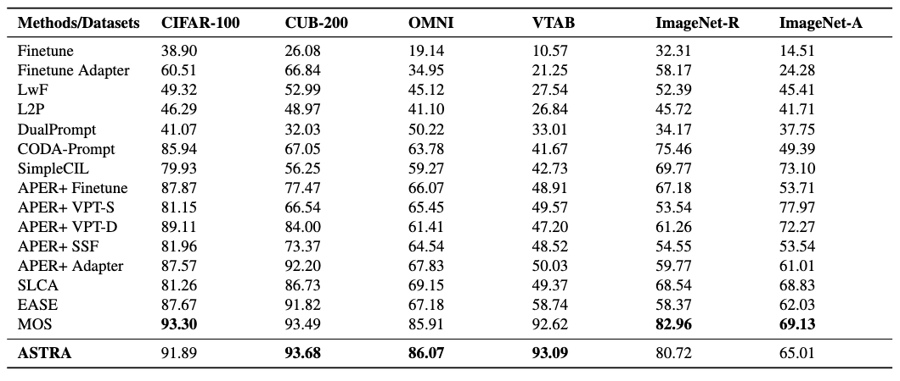

# ASTRA: Adaptive Single-pass Task Retrieval and Alignment for Pre Trained Model Based Class Incremental Learning


🎉The code repository for "ASTRA: Adaptive Single-pass Task Retrieval and Alignment for Pre Trained Model Based Class Incremental Learning" in PyTorch.

## Overview
Class Incremental Learning (CIL) with pre-trained models requires adapting to new tasks while mitigating catastrophic forgetting. Existing approaches address forgetting through replay-based methods that store past samples, regularization techniques, prompting strategies, and adapter-based methods. However, many of these methods rely on computationally expensive multi-pass self-refinement or require extensive memory. We propose ASTRA (Adaptive Single-pass Task Retrieval and Alignment), a more efficient framework that enhances feature refinement and streamlines task retrieval. ASTRA introduces shallow autoencoders with self-attention in the latent space to transfer only essential features and to eliminate iterative refinement, we introduce a Task Retrieval Network (TRN), enabling single-pass task alignment. ASTRA achieves competitive performance while being 2.46 times faster than the current state-of-the-art during inference, demonstrating its effectiveness for efficient and scalable class-incremental learning.



## 🎊 Results

We conducted experiments on seven benchmark datasets to verify the competitive performance of ASTRA.






## Requirements
### 🗂️ Environment
1. [torch 2.0.1](https://github.com/pytorch/pytorch)
2. [torchvision 0.15.2](https://github.com/pytorch/vision)
3. [timm 0.6.12](https://github.com/huggingface/pytorch-image-models)

### 🔎 Dataset
We provide the processed datasets as follows:
- **CIFAR100**: will be automatically downloaded by the code.
- **CUB200**:  Google Drive: [link](https://drive.google.com/file/d/1XbUpnWpJPnItt5zQ6sHJnsjPncnNLvWb/view?usp=sharing) or Onedrive: [link](https://entuedu-my.sharepoint.com/:u:/g/personal/n2207876b_e_ntu_edu_sg/EVV4pT9VJ9pBrVs2x0lcwd0BlVQCtSrdbLVfhuajMry-lA?e=L6Wjsc)
- **ImageNet-R**: Google Drive: [link](https://drive.google.com/file/d/1SG4TbiL8_DooekztyCVK8mPmfhMo8fkR/view?usp=sharing) or Onedrive: [link](https://entuedu-my.sharepoint.com/:u:/g/personal/n2207876b_e_ntu_edu_sg/EU4jyLL29CtBsZkB6y-JSbgBzWF5YHhBAUz1Qw8qM2954A?e=hlWpNW)
- **ImageNet-A**: Google Drive: [link](https://drive.google.com/file/d/19l52ua_vvTtttgVRziCZJjal0TPE9f2p/view?usp=sharing) or Onedrive: [link](https://entuedu-my.sharepoint.com/:u:/g/personal/n2207876b_e_ntu_edu_sg/ERYi36eg9b1KkfEplgFTW3gBg1otwWwkQPSml0igWBC46A?e=NiTUkL)
- **OmniBenchmark**: Google Drive: [link](https://drive.google.com/file/d/1AbCP3zBMtv_TDXJypOCnOgX8hJmvJm3u/view?usp=sharing) or Onedrive: [link](https://entuedu-my.sharepoint.com/:u:/g/personal/n2207876b_e_ntu_edu_sg/EcoUATKl24JFo3jBMnTV2WcBwkuyBH0TmCAy6Lml1gOHJA?e=eCNcoA)
- **VTAB**: Google Drive: [link](https://drive.google.com/file/d/1xUiwlnx4k0oDhYi26KL5KwrCAya-mvJ_/view?usp=sharing) or Onedrive: [link](https://entuedu-my.sharepoint.com/:u:/g/personal/n2207876b_e_ntu_edu_sg/EQyTP1nOIH5PrfhXtpPgKQ8BlEFW2Erda1t7Kdi3Al-ePw?e=Yt4RnV)
- **ObjectNet**: Onedrive: [link](https://entuedu-my.sharepoint.com/:u:/g/personal/n2207876b_e_ntu_edu_sg/EZFv9uaaO1hBj7Y40KoCvYkBnuUZHnHnjMda6obiDpiIWw?e=4n8Kpy) You can also refer to the [filelist](https://drive.google.com/file/d/147Mta-HcENF6IhZ8dvPnZ93Romcie7T6/view?usp=sharing) if the file is too large to download.

You need to modify the path of the datasets in `./utils/data.py`  according to your own path.
> These datasets are referenced in the [Aper](https://github.com/zhoudw-zdw/RevisitingCIL) 

## 🔑 Running scripts

Please follow the settings in the `exps` folder to prepare json files, and then run:

```
python main.py --config ./exps/[filename].json
```

**Here is an example of how to run the code** 

if you want to run the cifar dataset using ViT-B/16-IN1K, you can follow the script: 
```
python main.py --config ./exps/astra_cifar.json
```

if you want to run the cifar dataset using ViT-B/16-IN21K, you can follow the script: 
```
python main.py --config ./exps/astra_cifar_in21k.json
```

After running the code, you will get a log file in the `logs/astra/cifar224/` folder.

## 👨‍🏫 Acknowledgment

We would like to express our gratitude to the following repositories for offering valuable components and functions that contributed to our work.

- [PILOT: A Pre-Trained Model-Based Continual Learning Toolbox](https://github.com/sun-hailong/LAMDA-PILOT)
- [RevisitingCIL](https://github.com/zhoudw-zdw/RevisitingCIL)
